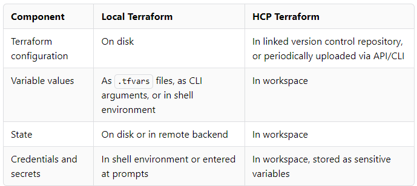

O que é o terraform Workspace
=======================================

Este tópico fornece uma visão geral do recurso de workspaces no HCP Terraform e no Terraform Enterprise. Um workspace é um grupo de recursos de infraestrutura gerenciados pelo Terraform.

Introdução
-------------------------------------------------------------

Trabalhar com o Terraform envolve o gerenciamento de coleções de recursos de infraestrutura, e a maioria das organizações gerencia muitas coleções diferentes.

Quando executado localmente, o Terraform gerencia cada coleção de infraestrutura com um diretório de trabalho persistente, que contém uma configuração, dados de estado e variáveis. Como o Terraform CLI usa o conteúdo do diretório em que é executado, você pode organizar os recursos de infraestrutura em grupos significativos, mantendo suas configurações em diretórios separados.

O HCP Terraform gerencia coleções de infraestrutura com workspaces em vez de diretórios. Um workspace contém tudo o que o Terraform precisa para gerenciar uma determinada coleção de infraestrutura, e workspaces separados funcionam como diretórios de trabalho completamente separados.

> Experimente o tutorial [Create a Workspace](https://developer.hashicorp.com/terraform/tutorials/cloud-get-started/cloud-workspace-create).

Conteúdo do workspace
-------------------------------------------------------------------------

Os workspaces do HCP Terraform e os diretórios de trabalho locais têm a mesma finalidade, mas armazenam seus dados de forma diferente:

Além do conteúdo básico do Terraform, o HCP Terraform mantém alguns dados adicionais para cada workspace:

**Versões de estado:** Cada workspace mantém backups de seus arquivos de estado anteriores. Embora apenas o estado atual seja necessário para o gerenciamento de recursos, o histórico do estado pode ser útil para rastrear alterações ao longo do tempo ou se recuperar de problemas. Consulte [Terraform State in HCP Terraform] (/terraform/cloud-docs/workspaces/state) para obter mais detalhes.
    
**Histórico de execução:** Quando o HCP Terraform gerencia as execuções do Terraform de um workspace, ele mantém um registro de todas as atividades de execução, incluindo resumos, registros, uma referência às alterações que causaram a execução e comentários do usuário. Consulte [Viewing and Managing Runs] (/terraform/cloud-docs/run/manage) para obter mais detalhes.
    

A parte superior de cada workspace mostra uma contagem de recursos, que reflete o número de recursos registrados no arquivo de estado do workspace. Isso inclui [Resources](https://developer.hashicorp.com/terraform/language/resources/syntax) e [Data Sources](https://developer.hashicorp.com/terraform/language/data-sources) gerenciados.

[Terraform Runs](https://developer.hashicorp.com/terraform/cloud-docs/workspaces#terraform-runs)
-----------------------------------------------------------------

Para workspaces com operações remotas ativadas (o padrão), o HCP Terraform executa o Terraform em suas próprias máquinas virtuais descartáveis, usando a configuração, as variáveis e o estado desse workspace.

Consulte [Terraform Runs and Remote Operations](https://developer.hashicorp.com/terraform/cloud-docs/run/remote-operations) para obter mais detalhes.

[workspaces do HCP Terraform vs. workspaces da CLI do Terraform](https://developer.hashicorp.com/terraform/cloud-docs/workspaces#hcp-terraform-vs-terraform-cli-workspaces)
------------------------------------------------------------------------------------------------------------------------

Tanto o HCP Terraform quanto o Terraform CLI têm recursos chamados workspaces, mas funcionam de forma diferente.

* Os workspaces do HCP Terraform são obrigatórios. Eles representam todas as coleções de infraestrutura em uma organização. Eles também são um componente importante do acesso baseado em função no HCP Terraform. É possível conceder permissões a usuários individuais e grupos de usuários para um ou mais workspaces que determinam se eles podem gerenciar variáveis, executar execuções, etc. Não é possível gerenciar recursos no HCP Terraform sem criar pelo menos um workspace.
    
* Os workspaces do Terraform CLI estão associados a um diretório de trabalho específico e isolam vários arquivos de estado no mesmo diretório de trabalho, permitindo que você gerencie vários grupos de recursos com uma única configuração. A CLI do Terraform não exige que você crie workspaces da CLI. Consulte [Workspaces](https://developer.hashicorp.com/terraform/language/state/workspaces) na documentação do Terraform Language para obter mais detalhes.
    

[Planejamento e organização de workspaces](https://developer.hashicorp.com/terraform/cloud-docs/workspaces#planning-and-organizing-workspaces)
---------------------------------------------------------------------------------------------------------

Recomendamos que as organizações dividam grandes configurações monolíticas do Terraform em configurações menores e, em seguida, atribuam cada uma delas ao seu próprio workspace e deleguem permissões e responsabilidades a elas. O HCP Terraform pode gerenciar configurações monolíticas muito bem, mas gerenciar a infraestrutura como componentes menores é a melhor maneira de aproveitar ao máximo os recursos de governança e delegação do HCP Terraform.

Por exemplo, o código que gerencia a infraestrutura do seu ambiente de produção poderia ser dividido em uma configuração de rede, na configuração do aplicativo principal e em uma configuração de monitoramento. Depois de dividir o código, você criaria workspaces “networking-prod”, “app1-prod”, “monitoring-prod” e designaria equipes separadas para gerenciá-los.

De forma semelhante à divisão de aplicativos monolíticos em microsserviços menores, isso permite que as equipes façam alterações em paralelo. Além disso, facilita a reutilização de configurações para gerenciar outros ambientes de infraestrutura (“app1-dev”, etc.).

No Terraform Enterprise, os administradores podem usar [Admin Settings](https://developer.hashicorp.com/terraform/enterprise/api-docs/admin/settings) para definir o número máximo de workspaces para uma única organização. Você também pode definir um limite de workspaces com o [tfe-terraform-provider](https://registry.terraform.io/providers/hashicorp/tfe/latest/docs/resources/organization#workspace_limit).

[Organizar workspaces com projetos](/https://developer.hashicorp.com/terraform/cloud-docs/workspaces#organize-workspaces-with-projects)
-------------------------------------------------------------------------------------------------------

Os projetos permitem que você organize seus workspaces em grupos.

**Nota:** No HCP Terraform **Standard** Edition, você pode atribuir permissões de projeto para o escopo de acesso a coleções de workspaces com base em unidades de negócios e responsabilidades. Consulte [Preços do HCP Terraform](https://www.hashicorp.com/products/terraform/pricing) para obter detalhes.

Consulte [Organize Workspaces with Projects](https://developer.hashicorp.com/terraform/cloud-docs/projects/manage) para obter mais detalhes.

[Criar workspaces](https://developer.hashicorp.com/terraform/cloud-docs/workspaces#creating-workspaces)
---------------------------------------------------------------------------

Você pode criar workspaces por meio da [HCP Terraform UI](https://developer.hashicorp.com/terraform/cloud-docs/workspaces/create), da [Workspaces API](https://developer.hashicorp.com/terraform/cloud-docs/api-docs/workspaces) ou da [HCP Terraform CLI integration](/terraform/cli/cloud).

Saúde do workspace
---------------------------------------------------------------------

**Nota:** As avaliações de integridade estão disponíveis no HCP Terraform **Plus** Edition. Consulte [Preços do HCP Terraform](https://www.hashicorp.com/products/terraform/pricing) para obter detalhes.

O HCP Terraform pode realizar avaliações automáticas de integridade em um workspace para avaliar se sua infraestrutura real corresponde aos requisitos definidos em sua configuração do Terraform. As avaliações de integridade incluem os seguintes tipos de avaliações:

* A detecção de desvios determina se a infraestrutura do mundo real corresponde à configuração do Terraform.
* A validação contínua determina se as condições personalizadas na configuração do workspace continuam a ser aprovadas depois que o Terraform provisiona a infraestrutura.

Você pode impor avaliações de integridade para todos os workspaces elegíveis ou permitir que cada workspace opte por avaliações de integridade por meio das configurações do workspace. Consulte [Health](https://developer.hashicorp.com/terraform/cloud-docs/workspaces/health) na documentação dos workspaces para obter mais detalhes.
