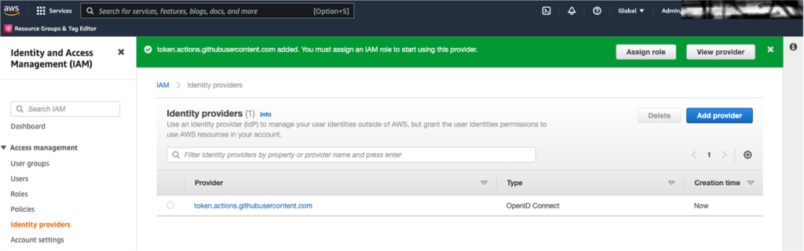
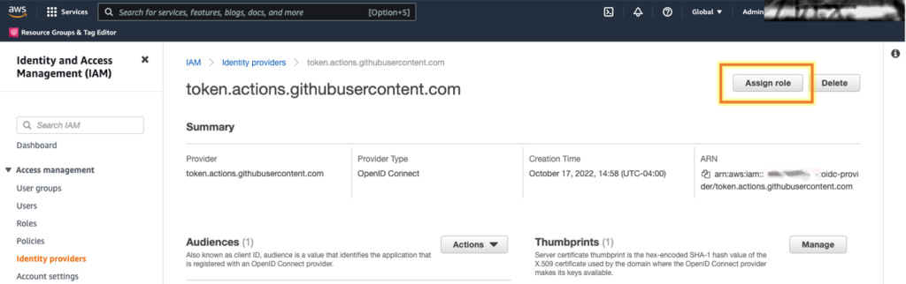
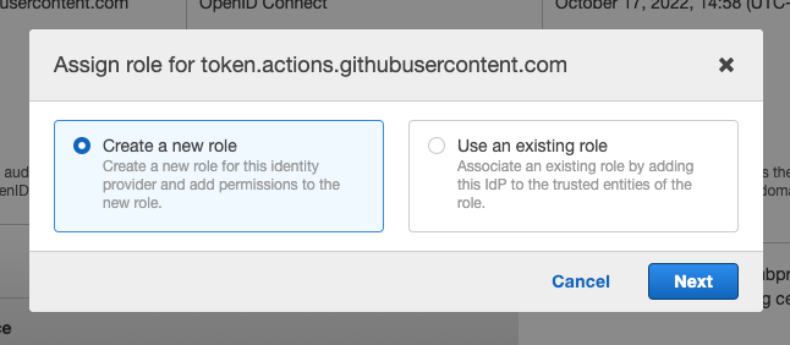
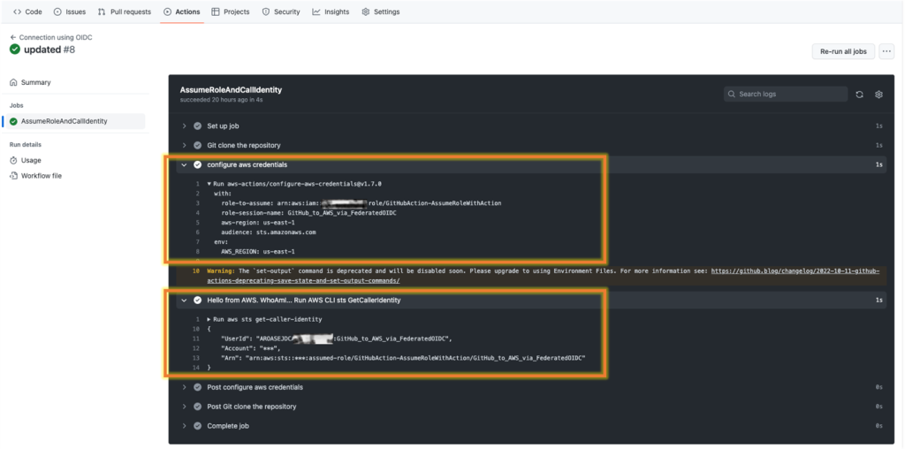
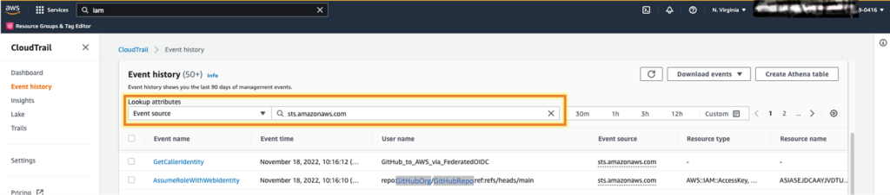
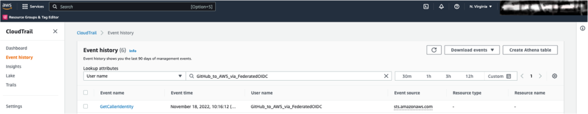
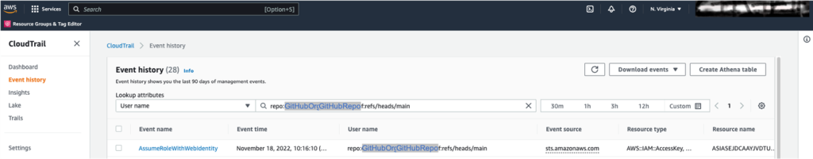

Você já quis iniciar uma alteração em uma conta [Amazon Web Services (AWS)](https://aws.amazon.com/) depois de atualizar um repositório do GitHub ou implantar atualizações em um aplicativo da AWS depois de mesclar um commit, sem o uso de chaves de acesso de usuário [AWS Identity and Access Management (IAM)](https://aws.amazon.com/iam/)? Se você configurar um provedor de identidade (IdP) [OpenID Connect (OIDC)](https://openid.net/connect/) dentro de uma conta do AWS, poderá usar funções do IAM e credenciais de curto prazo, o que elimina a necessidade de chaves de acesso de usuário do IAM.

Nesta postagem do blog, vamos orientá-lo nas etapas necessárias para configurar um repositório específico do GitHub para assumir uma função individual em uma conta do AWS para realizar alterações. Você aprenderá como criar uma conexão confiável OIDC com escopo para um repositório individual do GitHub e como mapear o repositório para uma função do IAM em sua conta. Você criará a conexão OIDC, a função IAM e a relação de confiança de duas maneiras: com o [AWS Management Console](https://aws.amazon.com/console/) e com a [AWS Command Line Interface (AWS CLI)](https://aws.amazon.com/cli/).

Esta postagem se concentra na [criação de um provedor de identidade IAM OIDC](https://docs.aws.amazon.com/IAM/latest/UserGuide/id_roles_providers_create_oidc.html) para o GitHub e demonstra como autorizar o acesso a uma conta da AWS a partir de um branch e repositório específicos. Você pode usar IdPs OIDC para fluxos de trabalho que suportam o padrão [OpenID Connect](http://openid.net/connect/), como Google ou Salesforce.

Pré-requisitos
-------------

Para acompanhar esta etapa, você deve ter os seguintes pré-requisitos em vigor:

* Possuir uma conta no GitHub [Quickstart on GitHub](https://docs.github.com/en/get-started) 
* A capacidade de [criar um novo arquivo de workflowdo GitHub Actions](https://docs.github.com/en/actions/using-workflows/about-workflows#create-an-example-workflow) no diretório .github/workflows/ em uma ramificação de um repositório do GitHub
* Uma conta do AWS
* Acesso às seguintes permissões de IAM na conta:
    * Deve ser capaz de [criar um OpenID Connect IdP](https://docs.aws.amazon.com/IAM/latest/APIReference/API_CreateOpenIDConnectProvider.html)
    * Deve ser capaz de [criar uma função de IAM e anexar uma política](https://docs.aws.amazon.com/IAM/latest/UserGuide/access_policies_job-functions_create-policies.html)

Visão geral da solução
-----------------

O GitHub é um provedor externo que é independente da AWS. Para usar o GitHub como um IdP do OIDC, você precisará concluir quatro etapas para acessar os recursos do AWS a partir do seu repositório do GitHub. Em seguida, na quinta e última etapa, você usará o [AWS CloudTrail](https://aws.amazon.com/cloudtrail/) para auditar a função que você criou e usou nas etapas 1 a 4.

1.  Crie um provedor OIDC em sua conta da AWS. Essa é uma relação de confiança que permite que o GitHub se autentique e seja autorizado a realizar ações em sua conta.
2.  Crie uma [função IAM](https://docs.aws.amazon.com/IAM/latest/UserGuide/id_roles.html) em sua conta. Em seguida, você definirá o escopo da relação de confiança da função IAM para as partes pretendidas da sua organização, repositório e branch do GitHub para que o GitHub assuma e execute ações específicas.
3.  Atribua um nível mínimo de permissões à função.
4.  Crie um arquivo de workflowdo GitHub Actions em seu repositório que possa invocar ações em sua conta.
5.  Audite o uso da função com os registros do Amazon CloudTrail.

Etapa 1: Crie um provedor OIDC em sua conta
-----------------------------------------------

A primeira etapa desse processo é criar um provedor OIDC que você usará na política de confiança para a função IAM usada nesta ação.

### Para criar um provedor OIDC para o GitHub (console):

1.  Abra o [console do IAM](https://console.aws.amazon.com/iam/).
2.  No menu de navegação esquerdo, escolha **Identity providers** (Provedores de identidade).
3.  No painel **Identity providers**, escolha **Add provider**.
4.  Em **Tipo de provedor**, escolha **OpenID Connect**.
5.  Em **Provider URL**, digite a URL do IdP OIDC do GitHub para esta solução: `https://token.actions.githubusercontent.com`
6.  Em **Audience**, digite `sts.amazonaws.com`. Isso permitirá que a API [AWS Security Token Service (AWS STS)](https://docs.aws.amazon.com/STS/latest/APIReference/welcome.html) seja chamada por esse IdP.
7.  (Opcional) Em **Add tags**, você pode adicionar pares de valores-chave para ajudá-lo a identificar e organizar seus IdPs. Para saber mais sobre a marcação de IdPs do IAM OIDC, consulte [Marcação de IdPs do OpenID Connect (OIDC)](images/01-01-01.png).
8.  Verifique as informações que você inseriu. Seu console deve corresponder à captura de tela da Figura 1. Após a verificação, escolha **Add provider**.  
    
    **Nota:** Cada provedor é uma relação de um para um com um IdP externo. Se quiser adicionar mais IdPs à sua conta, você pode repetir esse processo.
    
    
    
    Figura 1: Etapas para configurar o provedor de identidade
    
9.   Quando voltar à página **Identity providers**, você verá seu novo IdP, conforme mostrado na Figura 2. Selecione o provedor para visualizar suas propriedades e anote o Amazon Resource Name (ARN). Você usará o ARN mais adiante neste post. O ARN será semelhante ao seguinte:
    
    arn:aws:iam::111122223333:oidc-provider/token.actions.githubusercontent.com
    


Figura 2: Exibir seu provedor de identidade

### Para criar um provedor OIDC para o GitHub (AWS CLI):

Você pode adicionar o GitHub como um IdP na sua conta com um único comando do AWS CLI. O código a seguir executará as etapas anteriores descritas para o console, com os mesmos resultados. Para o valor -thumbprint-list, você usará a impressão digital OIDC do GitHub 938fd4d98bab03faadb97b34396831e3780aea1.

    aws iam create-open-id-connect-provider --url 
    “https://token.actions.githubusercontent.com” --thumbprint-list 
    “6938fd4d98bab03faadb97b34396831e3780aea1” ‐‐client-id-list 
    'sts.amazonaws.com'


Para saber mais sobre a impressão digital do GitHub, consulte [GitHub Actions - Update on OIDC based deployments to AWS](https://github.blog/changelog/2022-01-13-github-actions-update-on-oidc-based-deployments-to-aws/). No momento da publicação, essa impressão digital está correta.

Ambos os métodos anteriores adicionarão um IdP em sua conta. Você pode visualizar o provedor na página **Provedores de identidade** no console do IAM.

Etapa 2: Crie uma IAM role e defina o escopo da trust policy
-----------------------------------------------------

É possível criar uma função de IAM com o console do IAM ou com a CLI do AWS. Se optar por criar a função do IAM com a CLI do AWS, você definirá o escopo da política de relacionamento de confiança antes de criar a função.

O procedimento para criar a função de IAM e para definir o escopo da política de confiança vem do [Guia do usuário do AWS Identity and Access Management](https://docs.aws.amazon.com/iam/index.html). Para obter instruções detalhadas sobre como configurar uma função, consulte [How to Configure a Role for GitHub OIDC Identity Provider](https://docs.aws.amazon.com/IAM/latest/UserGuide/id_roles_create_for-idp_oidc.html#idp_oidc_Create_GitHub).

### Para criar a função de IAM (console IAM):

1.  No console do IAM, na tela **Identity providers** (Provedores de identidade), escolha o botão **Assign role** (Atribuir função) para o IdP recém-criado.
    


Figura 3: Atribuir uma função ao provedor de identidade
    
2.  Na caixa **Assign role for**, escolha **Create a new role** e, em seguida, escolha **Next**, conforme mostrado na figura a seguir.
    


Figura 4: Criar uma função a partir da página do provedor de identidade
    
3.  A página **Create role** apresenta algumas opções. A **Identidade da Web** já está selecionada como a entidade confiável, e o campo **Provedor de identidade** está preenchido com seu IdP. Na lista **Audience**, selecione **sts.amazonaws.com** e, em seguida, escolha **Next**.
4.  Na página **Permissions**, selecione **Next**. Para esta demonstração, você não adicionará permissões à função.
    
    Se quiser testar outras ações, como operações do [AWS CodeBuild](https://aws.amazon.com/codebuild/), você poderá adicionar permissões conforme descrito nestas postagens do blog: [Complete CI/CD with AWS CodeCommit, AWS CodeBuild, AWS CodeDeploy, and AWS CodePipeline](https://aws.amazon.com/blogs/devops/complete-ci-cd-with-aws-codecommit-aws-codebuild-aws-codedeploy-and-aws-codepipeline/) ou [Techniques for writing least privilege IAM policies](https://aws.amazon.com/blogs/security/techniques-for-writing-least-privilege-iam-policies/).
    
5. (Opcional) Na página **Tags**, adicione tags a essa nova função e, em seguida, escolha **Next: Review**.
6.  Na página **Create role**, adicione um nome de função. Para esta demonstração, digite GitHubAction-AssumeRoleWithAction. Opcionalmente, adicione uma descrição.
7.  Para criar a função, selecione **Create role**.

Em seguida, você definirá o escopo da política de confiança da função IAM para uma única organização, repositório e branch do GitHub.


### Para escopo da política de confiança (console IAM)

1.  No console do IAM, abra a função recém-criada e escolha **Editar relação de confiança**.
2.  Na página **Editar política de confiança**, modifique a política de confiança para permitir que sua organização, repositório e branch exclusivos do GitHub assumam a função. Este exemplo confia na organização do GitHub <aws-samples>, no repositório chamado <EXAMPLEREPO> e no branch chamado <ExampleBranch>. Atualize o ARN federado com o ARN do IdP do GitHub que você copiou anteriormente.
 ```json   
{
    "Version": "2012-10-17",
    "Statement": [
        {
            "Effect": "Allow",
            "Principal": {
                "Federated": "<arn:aws:iam::111122223333:oidc-provider/token.actions.githubusercontent.com>"
            },
            "Action": "sts:AssumeRoleWithWebIdentity",
            "Condition": {
                "StringEquals": {
                    "token.actions.githubusercontent.com:sub": "repo: <aws-samples/EXAMPLEREPO>:ref:refs/heads/<ExampleBranch>",
                    "token.actions.githubusercontent.com:aud": "sts.amazonaws.com"
                }
            }
        }
    ]
}    
```    

### Para criar uma função (AWS CLI)

Na CLI da AWS, use o exemplo de política de confiança mostrado acima para o console. Essa política foi projetada para limitar o acesso a uma organização, um repositório e um branch definidos do GitHub.

1.  Crie e salve um arquivo JSON com a política de exemplo em seu computador local com o nome de arquivo trustpolicyforGitHubOIDC.json.
2.  Execute o seguinte comando para criar a função.
    
        aws iam create-role --role-name GitHubAction-AssumeRoleWithAction --assume-role-policy-document file://C:\policies\trustpolicyforGitHubOIDC.json
    
    

Para obter mais detalhes sobre como criar uma função OIDC com a CLI da AWS, consulte [Creating a role for federated access (AWS CLI)](https://docs.aws.amazon.com/IAM/latest/UserGuide/id_roles_create_for-idp.html#roles-creatingrole-identityprovider-cli).


Etapa 3: Atribua um nível mínimo de permissões à função
---------------------------------------------------------

Para este exemplo, você não adicionará permissões à função IAM, mas assumirá a função e chamará [STS GetCallerIdentity](https://awscli.amazonaws.com/v2/documentation/api/latest/reference/sts/get-caller-identity.html) para demonstrar uma ação do GitHub que assume a função AWS.

Se você estiver interessado em executar ações adicionais na sua conta, poderá adicionar permissões à função que criou, GitHubAction-AssumeRoleWithAction. As ações comuns para fluxos de trabalho incluem chamar funções [AWS Lambda](https://aws.amazon.com/lambda/) ou enviar arquivos para um bucket [Amazon Simple Storage Service (Amazon S3)](https://aws.amazon.com/s3/). Para obter mais informações sobre como usar o IAM para aplicar permissões, consulte [Políticas e permissões no IAM](https://docs.aws.amazon.com/IAM/latest/UserGuide/access_policies.html).

Se quiser fazer um teste, você pode adicionar permissões conforme descrito nestas postagens do blog: [Complete CI/CD with AWS CodeCommit, AWS CodeBuild, AWS CodeDeploy, and AWS CodePipeline](https://aws.amazon.com/blogs/devops/complete-ci-cd-with-aws-codecommit-aws-codebuild-aws-codedeploy-and-aws-codepipeline/) ou [Techniques for writing least privilege IAM policies](https://aws.amazon.com/blogs/security/techniques-for-writing-least-privilege-iam-policies/).

Etapa 4: crie uma ação do GitHub para invocar a CLI do AWS
----------------------------------------------------

As [ações do GitHub](https://docs.github.com/en/actions) são definidas como métodos que você pode usar para automatizar, personalizar e executar seus fluxos de trabalho de desenvolvimento de software no GitHub. A ação do GitHub que você criar fará a autenticação na sua conta como a função que foi criada na Etapa 2: criar a função de IAM e o escopo da política de confiança.

### Para criar uma ação do GitHub para invocar a CLI do AWS:

1.  Crie um arquivo de fluxo de trabalho básico, como main.yml, no diretório .github/workflows do seu repositório. Esse exemplo de fluxo de trabalho assumirá a função GitHubAction-AssumeRoleWithAction para executar a ação aws sts get-caller-identity. Seu repositório pode ter vários fluxos de trabalho, cada um executando diferentes conjuntos de tarefas. Depois que o GitHub for autenticado na função com o fluxo de trabalho, você poderá usar os comandos da CLI do AWS na sua conta.
2.  Cole o seguinte exemplo de fluxo de trabalho no arquivo.
```yaml    
# This is a basic workflow to help you get started with Actions
name:Connect to an AWS role from a GitHub repository

# Controls when the action will run. Invokes the workflow on push events but only for the main branch
on:
  push:
    branches: [ main ]
  pull_request:
    branches: [ main ]

env:
  
  AWS_REGION : <"us-east-1"> #Change to reflect your Region

# Permission can be added at job level or workflow level    
permissions:
      id-token: write   # This is required for requesting the JWT
      contents: read    # This is required for actions/checkout
jobs:
  AssumeRoleAndCallIdentity:
    runs-on: ubuntu-latest
    steps:
      - name: Git clone the repository
        uses: actions/checkout@v3
      - name: configure aws credentials
        uses: aws-actions/configure-aws-credentials@v4
        with:
          role-to-assume: <arn:aws:iam::111122223333:role/GitHubAction-AssumeRoleWithAction> #change to reflect your IAM role’s ARN
          role-session-name: GitHub_to_AWS_via_FederatedOIDC
          aws-region: ${{ env.AWS_REGION }}
      # Hello from AWS: WhoAmI
      - name: Sts GetCallerIdentity
        run: |
          aws sts get-caller-identity    
```    
3.  Modifique o fluxo de trabalho para refletir as informações de sua conta do AWS:
    * AWS\_REGION: insira a região da AWS para seus recursos da AWS.
    * role-to-assume (função a ser assumida): Substitua o ARN pelo ARN da função AWS GitHubAction que você criou anteriormente.


No fluxo de trabalho de exemplo, se houver um push ou pull no branch “principal” do repositório, a ação que você acabou de criar será chamada.

A Figura 5 mostra as etapas do fluxo de trabalho em que o GitHub faz o seguinte:

* Autentica a função IAM com o IdP do OIDC na região que foi definida no arquivo de fluxo de trabalho na etapa configurar credenciais do aws.
* Chama o aws sts get-caller-identity na etapa Hello from AWS. WhoAmI... Executa o AWS CLI sts GetCallerIdentity.
    
    
    
    Figura 5: Resultados da ação do GitHub
    

Etapa 5: auditar o uso da função: Consultar os registros do CloudTrail
---------------------------------------------------

A etapa final é visualizar os logs do AWS CloudTrail em sua conta para auditar o uso dessa função.


### Para exibir os registros de eventos da ação do GitHub:

1.  No AWS Management Console, abra o CloudTrail e escolha **Event History**.
2.  Na lista **Lookup attributes**, escolha **Event source**.
3.  Na barra de pesquisa, digite sts.amazonaws.com.
    
    
    
    Figura 6: Localizar o histórico de eventos no CloudTrail
    
4.  Você deverá ver os eventos GetCallerIdentity e AssumeRoleWithWebIdentity, conforme mostrado na Figura 6. O evento GetCallerIdentity é a etapa Hello from AWS. no arquivo de fluxo de trabalho do GitHub. Esse evento mostra o fluxo de trabalho quando ele chama o aws sts get-caller-identity. O evento AssumeRoleWithWebIdentity mostra o GitHub autenticando e assumindo sua função IAM GitHubAction-AssumeRoleWithAction.

Você também pode visualizar um evento de cada vez.

### Para visualizar o evento GetCallerIdentity da CLI do AWS:

1.  Na lista **Lookup attributes**, escolha **User name**.
2.  Na barra de pesquisa, digite o nome da função-sessão, definido no arquivo de fluxo de trabalho em seu repositório. Esse não é o nome da função IAM, porque esse nome de sessão de função é definido na linha 30 do exemplo de fluxo de trabalho. No exemplo de fluxo de trabalho para esta postagem de blog, o nome da sessão de função é GitHub\_to\_AWS\_via\_FederatedOIDC.
3.  Agora você pode ver o primeiro evento no histórico do CloudTrail.
    
    
    
    Figura 7: Veja a identidade do autor da chamada no CloudTrail
    
### Para visualizar o evento AssumeRoleWithWebIdentity

1. Na lista **Atributos de pesquisa**, escolha **Nome de usuário**.
2. Na barra de pesquisa, insira a organização, o repositório e a ramificação do GitHub definidos na política de confiança da função do IAM. No exemplo descrito anteriormente, o nome de usuário é repo:aws-samples/EXAMPLE:ref:refs/heads/main.
3. Agora você pode ver o evento individual no histórico do CloudTrail.



Figura 8: Visualizar a chamada de função de suposição no CloudTrail

Conclusão
----------

Quando você usa funções do IAM com provedores de identidade OIDC, você tem uma maneira confiável de fornecer acesso aos seus recursos da AWS. O GitHub e outros provedores OIDC podem gerar [credenciais de segurança temporárias](https://docs.aws.amazon.com/IAM/latest/UserGuide/id_credentials_temp.html) para atualizar recursos e infraestrutura dentro de suas contas.

Nesta publicação, você aprendeu como usar o acesso federado para assumir uma função dentro da AWS diretamente de um arquivo de ação de fluxo de trabalho em um repositório do GitHub. Com esse novo IdP em vigor, você pode começar a [excluir chaves de acesso da AWS](https://aws.amazon.com/premiumsupport/knowledge-center/delete-access-key/) dos seus usuários do IAM e usar credenciais de curto prazo.

Depois de ler esta publicação, recomendamos que você siga a [diretiva AWS Well Architected Security Pillar IAM](https://wa.aws.amazon.com/wat.pillar.security.en.html#sec.iaam) para usar o acesso programático aos serviços da AWS usando credenciais temporárias e de privilégio limitado. Se você implantar [funções federadas do IAM](https://docs.aws.amazon.com/IAM/latest/UserGuide/id_roles_providers.html) em vez de chaves de acesso de usuário da AWS, siga esta diretriz e emita tokens pelo AWS Security Token Service. Se você tiver algum comentário sobre esta postagem, deixe um comentário abaixo e diga-nos como você gostaria de ver os fluxos de trabalho do OIDC expandidos para ajudar nas suas necessidades de IAM.


fonte: _https://aws.amazon.com/blogs/security/use-iam-roles-to-connect-github-actions-to-actions-in-aws/_
